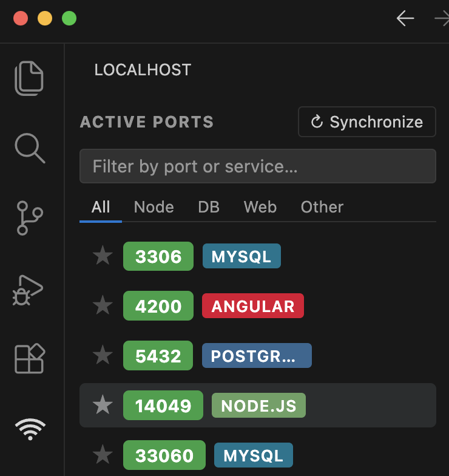

# Localhost Ports Viewer

[](https://marketplace.visualstudio.com/items?itemName=danilodevsilva.localhost-ports-viewer)
[](https://marketplace.visualstudio.com/items?itemName=danilodevsilva.localhost-ports-viewer)
[](https://code.visualstudio.com/)
[](https://marketplace.visualstudio.com/items?itemName=danilodevsilva.localhost-ports-viewer)

> **See every service running on your machine — without leaving VS Code.**
> Open, copy, or kill any localhost port directly from the sidebar.

---

## Why Localhost Ports Viewer?

When you're running multiple services at once — a React frontend, a Node API, a database, a queue — keeping track of which port is which is a pain. This extension puts all active localhost services in one place, right inside VS Code, with automatic framework detection.

No more `lsof -i | grep LISTEN`. No more forgotten ports.

---

## Features

### Real-time port monitoring
All TCP ports currently listening on your machine, updated automatically. No manual refresh needed.

### Automatic framework & service detection
Identifies what's running on each port by reading `package.json` and process information:

| Category | Detected |
|---|---|
| **Frontend** | React, Next.js, Vue, Nuxt, Angular, Svelte, SvelteKit, Astro, Remix, Vite |
| **Backend** | Express, Fastify, NestJS, Koa, Hapi, Hono, Elysia |
| **Databases** | PostgreSQL, MySQL, MongoDB, Redis |
| **Other** | Spring Boot, Laravel, Rails, Django, FastAPI, Flask, Go, PHP, Nginx, Apache |

### One-click actions (hover a port to reveal)
- **↗ Open** — opens `http://localhost:<port>` in the browser (system default or VS Code Simple Browser)
- **⎘ Copy port** — copies just the port number to clipboard
- **🔗 Copy URL** — copies the full `http://localhost:<port>` URL
- **✕ Kill** — terminates the process with a confirmation dialog

### Search & filter
- Type to filter by port number or service name
- Quick tabs: **All · Node · DB · Web · Other**

### Favorites
Star any port to pin it to the top with a gold highlight — survives restarts.

### Native VS Code theming
Fully adapts to any theme: dark, light, high contrast. Uses VS Code CSS variables throughout.

---

## Preview



> 💡 *Hover over any row to reveal the action buttons.*

---

## Settings

| Setting | Default | Description |
|---|---|---|
| `localhostPortsViewer.refreshInterval` | `5000` | Auto-refresh interval in ms (min 1000) |
| `localhostPortsViewer.commandTimeout` | `5000` | Timeout per OS command in ms |
| `localhostPortsViewer.openBrowserTarget` | `"external"` | `"external"` = system browser · `"internal"` = VS Code Simple Browser |
| `localhostPortsViewer.debugLogs` | `false` | Enable verbose logs in the Output panel |

---

## How It Works

The extension uses OS-level commands to list listening TCP ports:

- **macOS**: `lsof -iTCP -sTCP:LISTEN`
- **Linux**: `ss -lntp` (fallback: `lsof`)
- **Windows**: PowerShell `Get-NetTCPConnection`

For each port, it reads the process `package.json` to identify the exact framework. Results are cached per-PID (15s TTL) to keep refreshes fast.

---

## Installation

Search **Localhost Ports Viewer** in the VS Code Extensions panel, or:

```bash
code --install-extension danilodevsilva.localhost-ports-viewer
```

After installing, click the **wifi icon** in the Activity Bar on the left.

---

## Feedback & Issues

Found a bug or have a feature request? [Open an issue on GitHub](https://github.com/daniloagostinho/localhost-ports-viewer/issues).

If this extension saves you time, consider leaving a ⭐ [review on the Marketplace](https://marketplace.visualstudio.com/items?itemName=danilodevsilva.localhost-ports-viewer&ssr=false#review-details) — it really helps!

---

## License

[MIT](LICENSE.txt)
